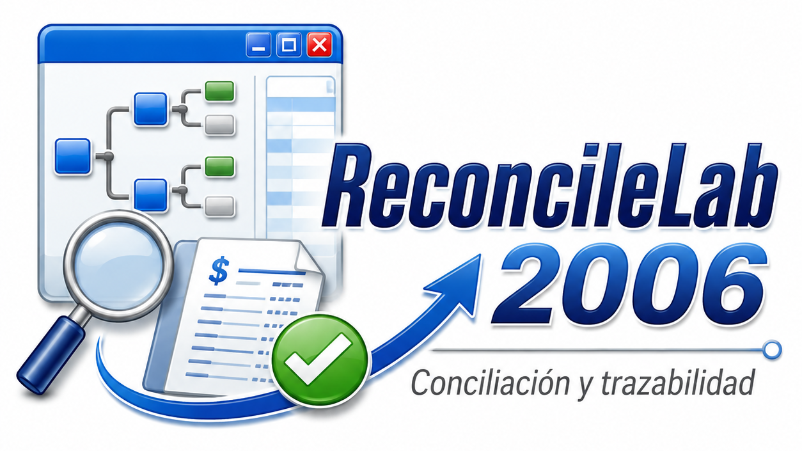
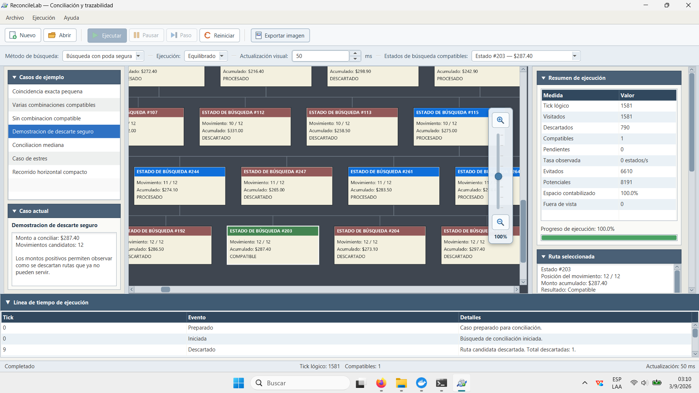
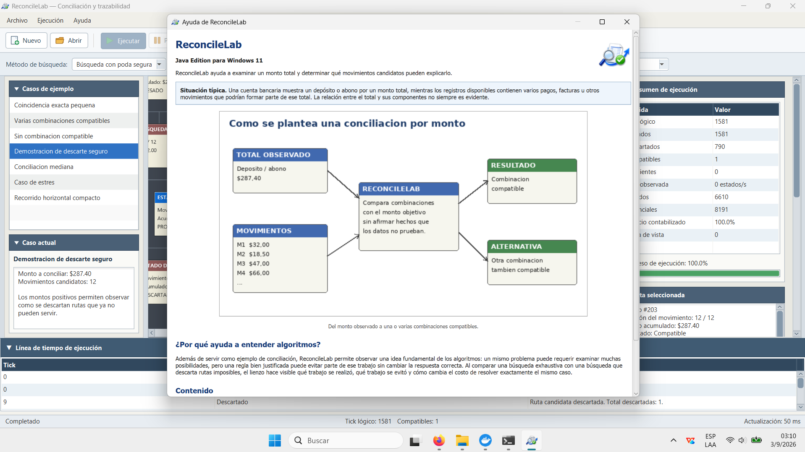
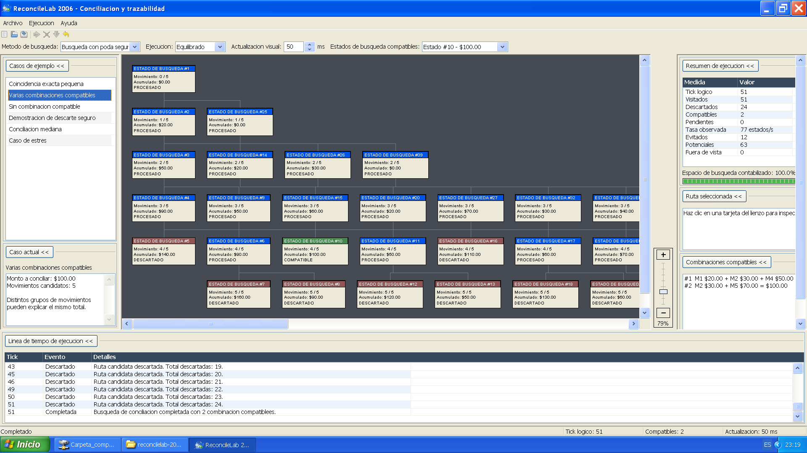
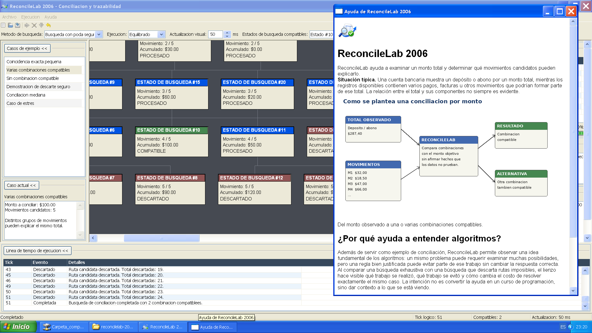

<p align="center">
  
</p>

# ReconcileLab

**Laboratorio técnico de conciliación y trazabilidad con dos implementaciones
del mismo producto: una edición C++ deliberadamente retro para Windows XP y una
edición moderna Java 21/JavaFX para Windows 11.**

ReconcileLab 2006 parte de un problema sencillo: existe un depósito, abono o
monto total conocido y una lista de movimientos candidatos, pero no está clara
la relación entre el total y los importes que podrían componerlo.

El programa busca combinaciones numéricamente compatibles y permite observar
cómo se desarrolla el trabajo en un gran lienzo desplazable.

> Una combinación compatible demuestra consistencia numérica, no la verdad
> histórica de una operación. Una conciliación real puede requerir referencias,
> fechas y otros documentos.

## Un proyecto 2006 × 2026

Este repositorio mezcla deliberadamente dos épocas.

**2006:** Windows XP, C++, wxWidgets, scripts `.bat`, controles nativos,
aplicación portable y una interfaz que no intenta parecer una web moderna.

**2026:** GitHub, pruebas, documentación, verificación reproducible, separación
de responsabilidades, comentarios pedagógicos y artefactos de branding
conservados dentro del propio repositorio.

El objetivo no es construir un sistema bancario ni una plataforma genérica de
algoritmos. Debe seguir siendo suficientemente pequeño para estudiar el
repositorio completo.


## Dos ediciones, un mismo producto

El repositorio contiene ahora dos implementaciones deliberadamente comparables:

```text
ReconcileLab 2006
C++ + wxWidgets 3.0.5
Windows XP SP3 x86

java-win11/
Java 21 + JavaFX
Windows 11
```

La edición Java no reinventa la disposición. Conserva la misma gramática
espacial: menú, toolbar, franja de ejecución, casos a la izquierda, workspace
central, inspector a la derecha, timeline inferior y status bar.

Los archivos `.case`, la ayuda de dominio y el branding continúan teniendo su
fuente canónica en la raíz. Maven los incorpora a la edición Java durante el
build, evitando duplicar los ejemplos.

La carpeta `java-win11/` ya contiene una segunda implementación funcional:
motor portado, runtime separado de la GUI, canvas matemático, zoom/pan,
navegación a compatibles, creación y apertura de casos, ayuda, exportación,
tests, `verify-all.bat`, app-image y preparación de instalador mediante
`jpackage`.

Su identidad Java canónica es:

```text
groupId: com.marcosmoreiradev
package: com.marcosmoreiradev.reconcilelab
vendor:  Marcos Moreira Dev
```

Consulta:

```text
java-win11/README.md
docs/DUAL-EDITION.md
```

## Inicio rápido en la VM de Windows XP

Ejecuta:

```bat
verify-all.bat
```

El diagnóstico de la última ejecución siempre queda en:

```text
.local\verify-all.txt
```

Para abrir el programa:

```bat
run.bat
```

Entorno validado:

```text
TDM-GCC 9.2.0 x86
wxWidgets 3.0.5, compilación estática Unicode
Windows XP SP3 x86
```

## Los ejemplos son archivos reales

Los presets de la interfaz son los mismos archivos `.case` almacenados en:

```text
examples/
```

No existe un sistema paralelo de presets embebidos. Los archivos pueden abrirse
con un editor de texto.

## Organización

```text
src/model/       datos del dominio
src/engine/      búsqueda de conciliación
src/runtime/     ritmo y ejecución en segundo plano
src/io/          lectura/escritura de casos y montos
src/ui/          wxWidgets y lienzo gráfico
examples/        casos de ejemplo
help/            ayuda integrada para el usuario
tests/           pruebas del núcleo
docs/            documentación técnica
assets/          identidad visual y otros recursos
resources/       recursos Win32 enlazados al ejecutable
scripts/         compilación, ejecución y verificación
```

## Identidad visual

La carpeta:

```text
assets/branding/
```

contiene dos piezas canónicas:

- el logotipo completo para GitHub y presentación;
- el icono sin texto para el ejecutable, barra de título y diálogos.

El icono de Windows se enlaza también como recurso del `.exe`.

## Disposición de diagramas

En la raíz se conserva:

```text
ALGORITMO-DISPOSICION-DE-DIAGRAMAS.md
```

Describe el algoritmo sencillo de cajas/capas utilizado como base conceptual
para evitar superposiciones. Está escrito para poder reutilizarlo en otros
proyectos, por ejemplo en un diagrama de clases.

## Capturas

El repositorio documenta las dos ediciones ejecutándose en sus plataformas
objetivo. Las capturas se conservan en `docs/screenshots/` sin recortes ni
retoques.

### Edición moderna — Java 21 / JavaFX / Windows 11

<p align="center">
  
</p>

La edición moderna mantiene la gramática espacial de la aplicación original:
casos a la izquierda, gran lienzo central, inspector a la derecha, línea de
tiempo inferior y barra de estado. Sobre el lienzo aparece un HUD fijo de zoom,
mientras JavaFX aporta componentes más limpios, iconografía con pequeños
acentos de color y una presentación propia de Windows 11.

<p align="center">
  
</p>

La ayuda integrada conserva la explicación de dominio: parte de un monto total,
movimientos candidatos y combinaciones numéricamente compatibles, y recuerda
que una coincidencia matemática no demuestra por sí sola la historia real de
una operación.

### Edición retro — C++ / wxWidgets / Windows XP

<p align="center">
  
</p>

La edición C++ conserva el aspecto, controles y restricciones de un programa de
escritorio de mediados de los 2000, ejecutado realmente sobre Windows XP SP3
x86.

<p align="center">
  
</p>

Las dos interfaces no intentan ser idénticas píxel por píxel. Comparten dominio,
formato `.case`, significado de métricas, estrategias de búsqueda y gramática
espacial, mientras cada toolkit conserva su propia época.

## Estado

**C++ / Windows XP:** `0.5.11` — edición retro validada visualmente en Windows XP.

**Java / Windows 11:** `0.7.5` — edición moderna promovida como release estable; validada en Windows 11 con Temurin 21 y preparada para distribución autocontenida mediante `jpackage` + WiX. Incluye HUD de zoom, timeline redimensionable, exportación PNG adaptativa, ayuda integrada, JUnit, Checkstyle, JaCoCo y Javadoc.

Los binarios de Windows 11 se publican como assets de GitHub Releases; `target/` permanece fuera del repositorio.

## Licencia

Todavía no se ha elegido una licencia.
